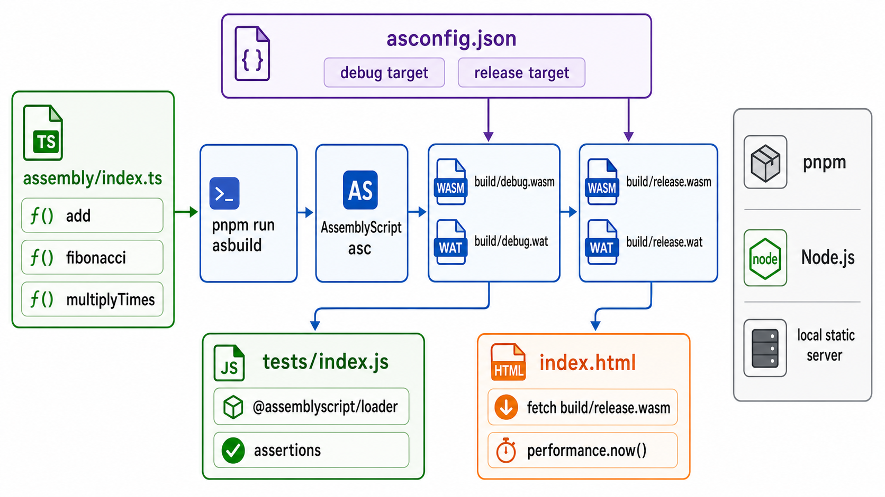

<div align="center">
  

  **⚡ Sandbox for experimenting with AssemblyScript and WebAssembly 🕸️**
</div>

sandbox-assemblyscript is a small AssemblyScript project that compiles typed arithmetic functions to WebAssembly. It includes Node.js tests for the debug and release builds, plus a browser demo that compares JavaScript and WebAssembly timing.

Use it as a minimal reference for compiling AssemblyScript, loading `.wasm` files from JavaScript, and checking the generated output in both Node.js and the browser.

## Install

```bash
git clone https://github.com/tsilva/sandbox-assemblyscript.git
cd sandbox-assemblyscript
pnpm install
pnpm run asbuild
pnpm test
pnpm run serve
```

Open [http://localhost:3000](http://localhost:3000).

## Commands

```bash
pnpm run asbuild          # build debug and release WASM output
pnpm run asbuild:debug    # build build/debug.wasm and build/debug.wat
pnpm run asbuild:release  # build build/release.wasm and build/release.wat
pnpm test                 # run Node.js assertions against both builds
pnpm run serve            # serve index.html and local demo assets
```

## Notes

- `package.json` enforces pnpm during install.
- Run `pnpm run asbuild` before `pnpm test` or the browser demo so `build/*.wasm` exists.
- `tests/index.js` loads WASM synchronously with `fs.readFileSync` and instantiates it with `@assemblyscript/loader`.
- `index.html` imports `@assemblyscript/loader` from `node_modules`, so the demo should be opened through the local static server.

## Architecture



## License

[MIT](LICENSE)
